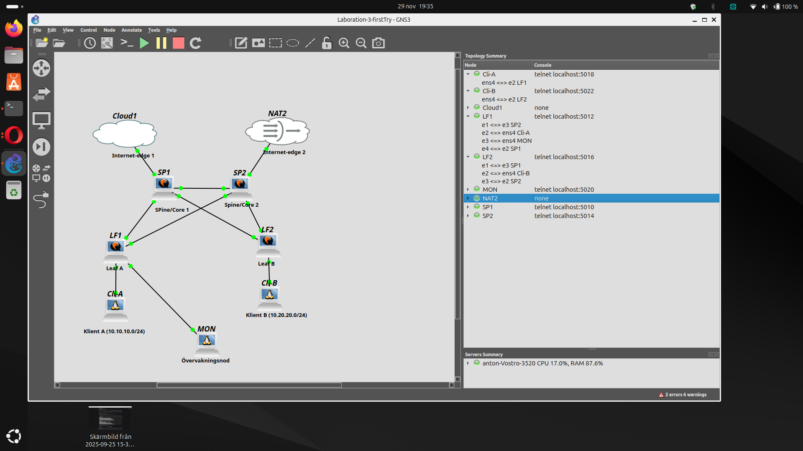

## Översikt

Detta repo innehåller konfigurationer och dokumentation från Laboration 3 där vi byggde en redundant routing-fabric med Arista vEOS.

### Topologi

## Teknologier

- **Routing:** OSPF med multi-area design (Area 0, 10, 20)
- **Redundans:** ECMP (Equal-Cost Multi-Path)
- **Övervakning:** Syslog + ICMP monitoring
- **Segmentering:** Internet-access endast för CLI-A

## IP-Plan

Se [docs/ip-plan.md](docs/ip-plan.md)

## OSPF Design

- **Area 0:** Backbone (alla fabric-länkar)
- **Area 10:** LF1 client networks (summerad till 10.10.0.0/16)
- **Area 20:** LF2 client networks (summerad till 10.20.0.0/16)

## Failover-Resultat

| Scenario | Konvergenstid | Tappade paket | Resultat |
|----------|---------------|---------------|----------|
| SP1-LF1 länk ned | <1 sekund | 0 | Traffic via SP2 ✓ |
| SP1 total failure | ~30 sekunder | 30 (till SP1) | Fabric via SP2 ✓ |

## Internet-Access

- **CLI-A:** Kan nå Internet via LF1 → SP1 → NAT ✓
- **CLI-B:** Ingen Internet-åtkomst (ingen default route) ✗

## Verktyg

- **Platform:** GNS3
- **Switches:** Arista vEOS 4.29.2F
- **Clients:** Debian Linux
- **Monitoring:** rsyslog, ping, mtr
